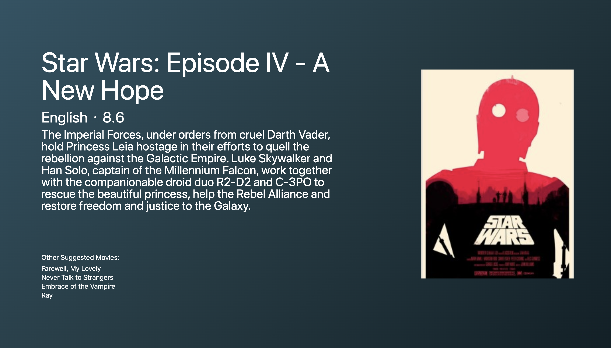

# Apollo 2020

- Movie App built with React, Apollo and GraphQl.
- Getting data from movie api made with GraphQl here(https://github.com/hoon0624/movieql)

## Setup

- `yarn add`
  - `styled-components`
  - `react-router-dom`
  - `apollo-boost @apollo/react-hooks graphql`

## Demo

- Like or Unlike movies
  
